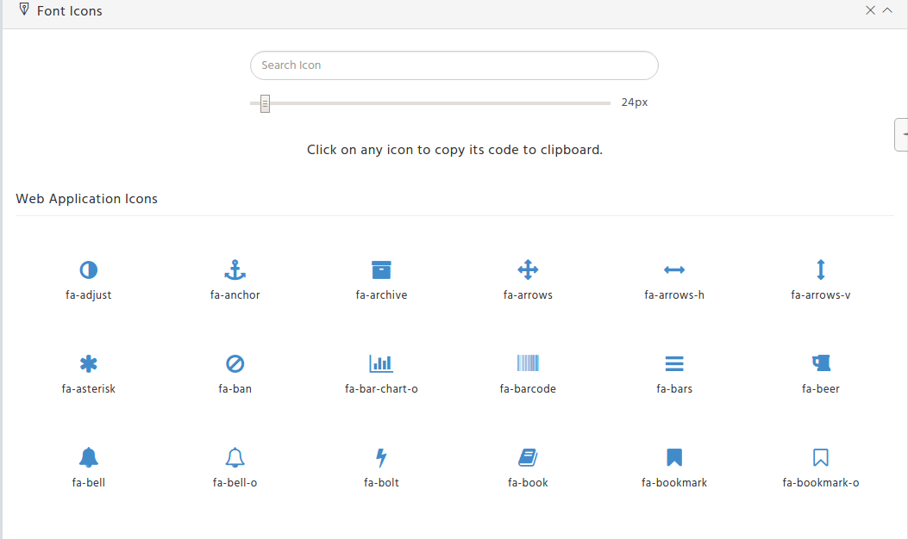
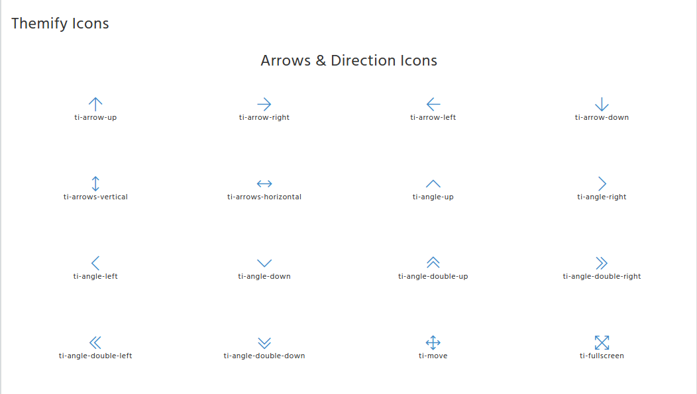
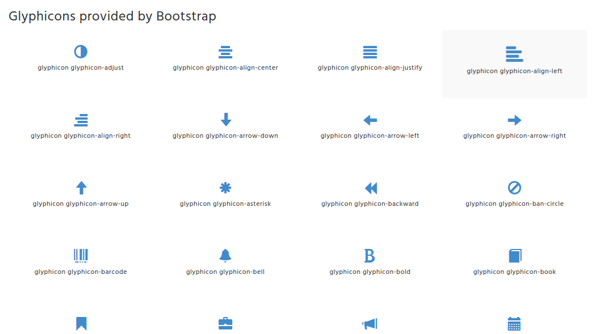
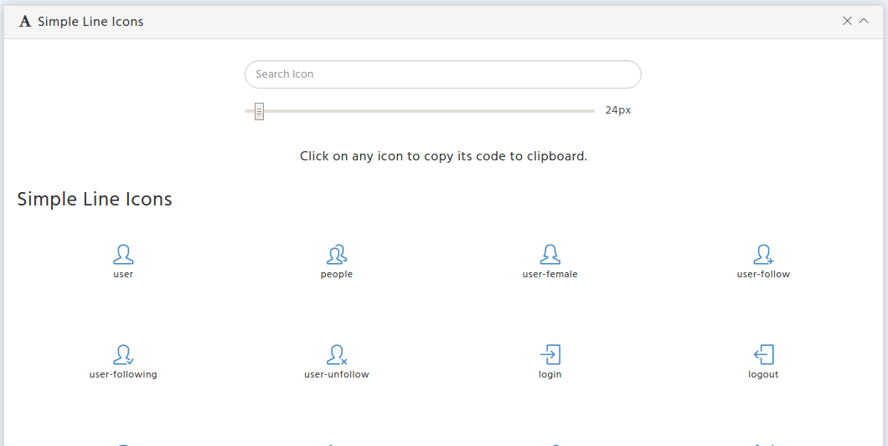

# Font Icons

There are four different types of icons included in this theme. In this page we gave an option for maximizing the size of a font and upon a click, the font gets copied to the clipboard and can be pasted anywhere. We can see the demo for this in the page.[Font Icons](http://coreplus.lorvent.in/fonts.html) of this Template.

**1\) Font Awesome Icons :**



It has the following Structure:

```text
<a href="#">
  <i class="fa fa-phone"></i>
</a>
```

**Icons Size** - determines the size of icons, can take such values: fa-lg, fa-2x, fa-3x, fa-4x and fa-5x

```text
<a href="#">
  <i class="fa fa-phone fa-lg"></i>
</a>
```

**Stacked icons** - It stacks the multiple icons. we can also control the size of the icons using the parameters : fa-stack-1x fa-stack-2x.

```text
<span class="fa-stack fa-lg">
 <i class="fa fa-circle fa-stack-2x text-info"></i>
   <i class="fa fa-home fa-stack-2x fa-inverse"></i>
</span>
```

**2\) Themify Icons**



It has the following Structure:

```text
<a href="#">
  <i class="ti arrow-up"></i>
</a>
```

We can import our desired icon just by replacing `arrow-up`in the above code with the icon we want.

**3\) Glyphicons**



It has the following Structure:

```text
<li>
  <span class="glyphicon glyphicon-cloud-download"> </span>
  <span class="glyphicon-class">glyphicon glyphicon-cloud-download</span> 
</li>
```

We can import our desired icon just by replacing `glyphicon-cloud-download` in the above code with the icon we really need.

**4\) Simple Line Icons**



It has the following Structure:

```text
<div class="preview">
    <i class="icon-user icons"></i>
    <span class="name">user</span>
</div>
```

