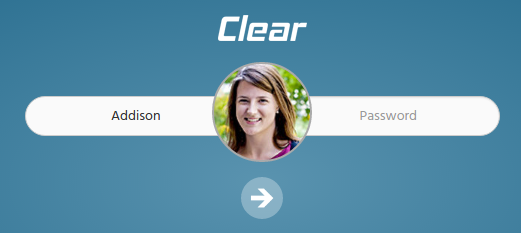

# Lock Screen

This is the unique feature in this template which generally is designed for the Authentication purpose.This element can be found in `lockscreen` pages of this template.



It has the following Structure:

```text
<div class="row">
    <div class="col-lg-12 login_border_radius1 lockscreen_img">
     ...
     ...
    </div>
     ...
     ...
</div>
```

