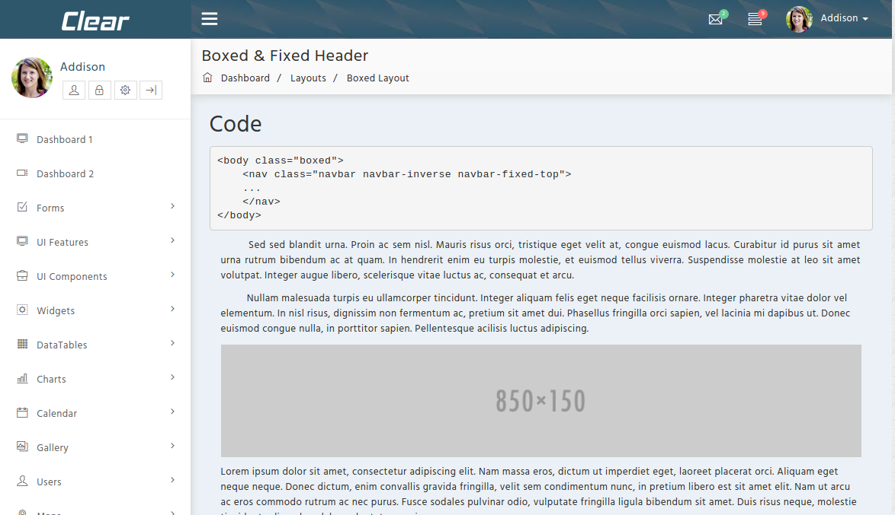

# Boxed and Fixed Header

It has the following design:



It has the following Structure:

```text
<body class="skin-default boxed fixed-menu">
<div class="preloader">
          ...
          ...
 </div>
 <header class="header header_movable">
     <nav class="navbar navbar-fixed-top" role="navigation">
       ...
     </nav>
 </header>
 <div class="wrapper row-offcanvas row-offcanvas-left">
   ...
 </div>
 </body>
```

