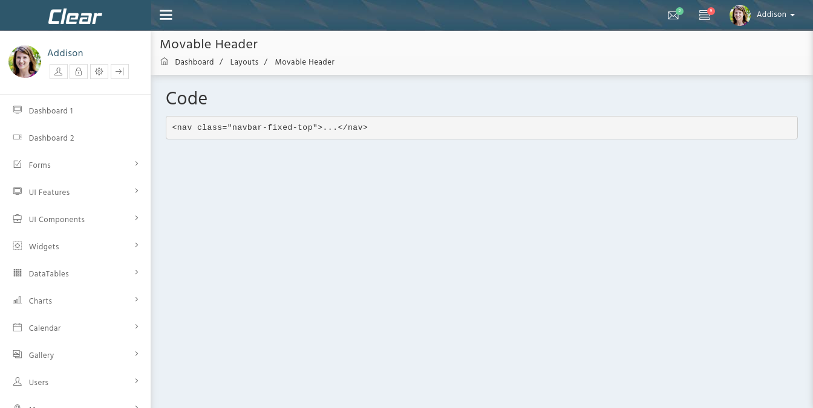

# Moveable Header

The design for Menubar Fold is shown below:



It has the following structure:

```text
<body class="skin-default movable-header">
<div class="preloader">
          ...
          ...
 </div>
 <header class="header header_movable">
     <nav class="navbar navbar-static-top" role="navigation">
       ...
     </nav>
 </header>
 <div class="wrapper row-offcanvas row-offcanvas-left">
   ...
 </div>
 </body>
```

